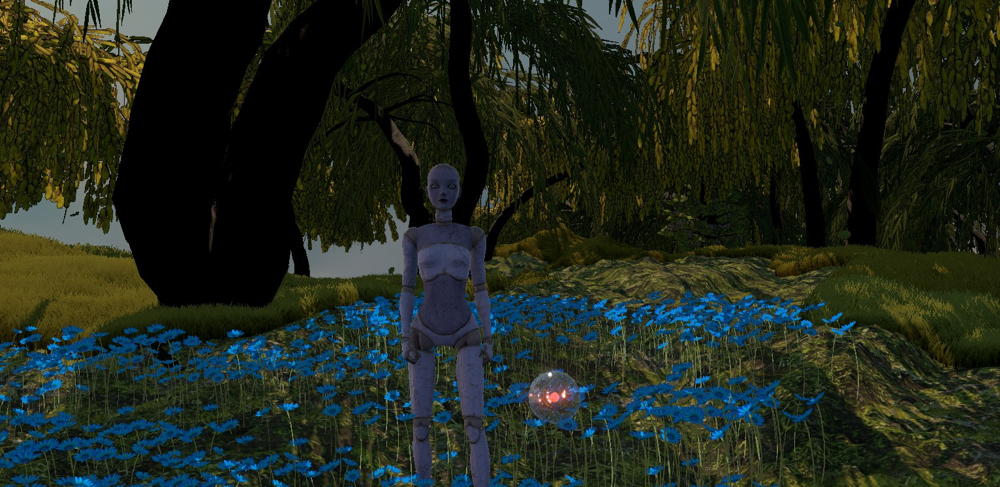
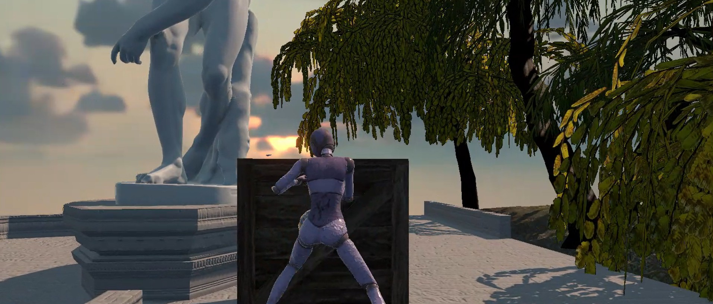
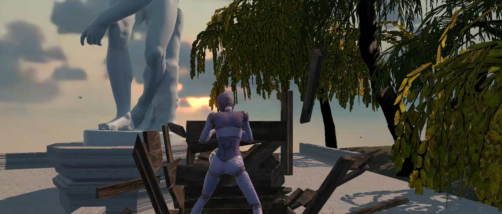

# 3D Treasure Hunt

A 3D adventure treasure hunt prototype developed in Unity.
The player explores a stylized environment, interacts with objects, and fights using combo attacks while being guided by a magical fairy companion.

The project focuses on exploration mechanics and visual atmosphere through shaders, particle systems, and environmental effects.

  
  

